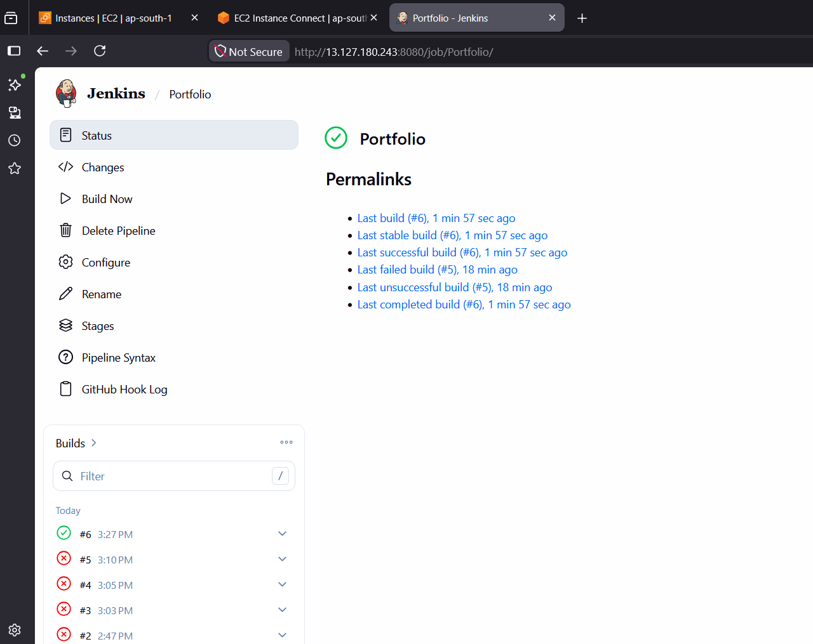
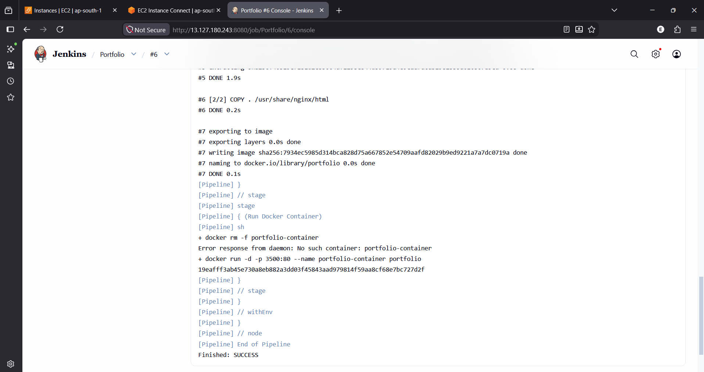
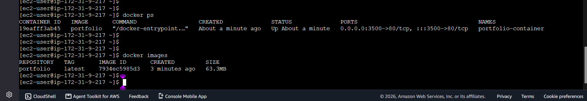
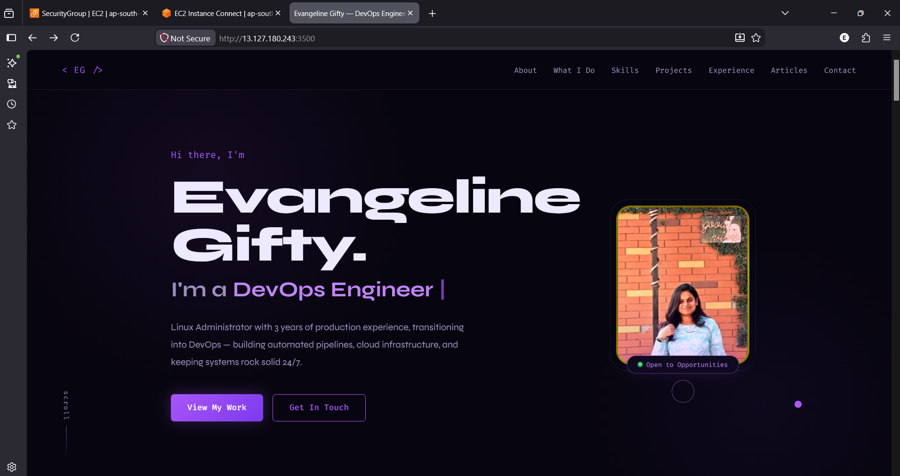

# 🚀 Portfolio Website CI/CD with Jenkins & Docker

This project demonstrates a simple CI/CD pipeline for deploying a static portfolio website using **Jenkins**, **Docker**, and **Nginx**.

The Jenkins pipeline automatically clones the source code from GitHub, builds a Docker image, and deploys the website inside an Nginx container.

---

## 📌 Technologies Used

- Jenkins
- Docker
- Nginx
- Git
- GitHub
- HTML
- CSS
- JavaScript

---

## 📂 Project Structure

```
Portfolio/
│── Dockerfile
│── Jenkinsfile
│── index.html
│── README.md
```

---

## ⚙️ Jenkins Pipeline

The pipeline consists of three stages:

### 1️⃣ Clone Code
Clones the latest source code from the GitHub repository.

### 2️⃣ Build Docker Image
Builds the Docker image using the Dockerfile.

```bash
docker build -t portfolio .
```

### 3️⃣ Run Docker Container
Removes any existing container and starts a new container.

```bash
docker rm -f portfolio-container || true

docker run -d -p 3500:80 \
--name portfolio-container \
portfolio
```

---

## 🐳 Dockerfile

```dockerfile
FROM nginx:alpine

COPY . /usr/share/nginx/html

EXPOSE 80
```

---

## ▶️ Running Locally

Clone the repository

```bash
git clone https://github.com/Evangeline-Gifty/Portfolio.git
```

Go into the project

```bash
cd Portfolio
```

Build the Docker image

```bash
docker build -t portfolio .
```

Run the container

```bash
docker run -d -p 3500:80 --name portfolio-container portfolio
```

Open the application

```
http://localhost:3500
```

---

## 📸 Screenshots

- Jenkins Successful Build



- Jenkins Console Output



- Docker Image & Running Container (`docker ps`)



- Portfolio Website



---

## 🎯 Features

- Automated CI/CD using Jenkins
- Dockerized deployment
- Lightweight Nginx web server
- Easy local deployment
- Beginner-friendly DevOps project

---

## 👩‍💻 Author

**Evangeline Gifty**

DevOps Engineer | Linux Administrator | AWS | Docker | Kubernetes | Jenkins | Terraform

GitHub: https://github.com/Evangeline-Gifty